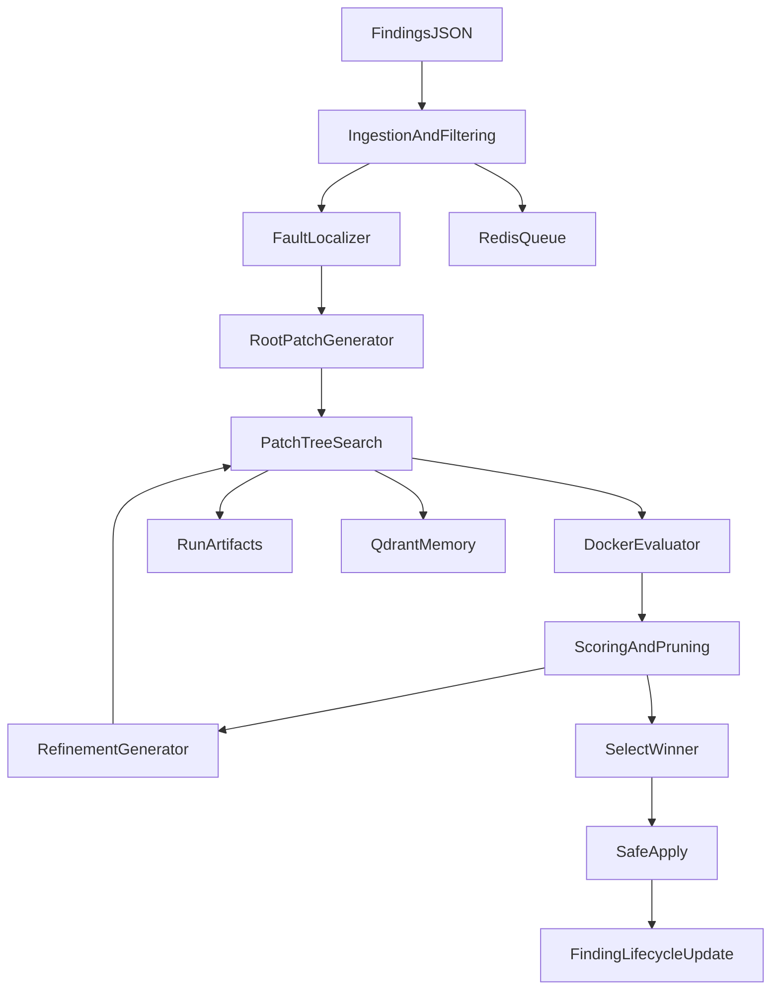

# LYRA Patch-Tree Repair Engine

## Purpose

`repair_engine/` is a standalone service that upgrades LYRA from single-shot patching to patch-tree search:

1. ingest findings
2. localize likely fault surfaces
3. generate multiple root patches
4. sandbox-evaluate each patch
5. expand promising branches
6. rank/select winner
7. auto-apply winner (no auto-commit)

The engine is built to be compatible with existing finding/state conventions used in `audits/open_findings.json` and `audits/session.py`.

## Safety Guarantees

- Never auto-commits or opens PRs.
- Respects protected path denylist by default:
  - `.github/`
  - `expectations/`
  - `audits/schema/`
- Can run dry-run mode (`LYRA_DRY_RUN=true`) to simulate apply.
- Caps patch blast radius with `LYRA_MAX_FILES_CHANGED`.

## Architecture



## Module Map

- `repair_engine/cli.py`: command interface (`run`, `enqueue`, `worker`, `status`)
- `repair_engine/orchestrator.py`: end-to-end execution loop
- `repair_engine/ingestion.py`: load/filter findings
- `repair_engine/localization.py`: fault slicing from proof hooks + affected files
- `repair_engine/generation.py`: root and refinement patch candidate generation
- `repair_engine/tree_search.py`: node graph, pruning, beam handling
- `repair_engine/scoring.py`: scorecards and ranking metrics
- `repair_engine/evaluator/docker_runner.py`: isolated candidate execution
- `repair_engine/apply.py`: protected apply and status/history updates
- `repair_engine/providers/vllm_client.py`: batched model completion client
- `repair_engine/queue/redis_queue.py`: Redis queue primitives
- `repair_engine/memory/qdrant_store.py`: similarity memory and successful patch recall

## Environment Variables

### Search

- `LYRA_ROOT_BRANCHING_FACTOR` (default `5`)
- `LYRA_BEAM_WIDTH` (default `2`)
- `LYRA_MAX_DEPTH` (default `2`)
- `LYRA_MAX_EVALS_PER_FINDING` (default `20`)
- `LYRA_MIN_EXPAND_SCORE` (default `0.65`)

### Evaluation

- `LYRA_EVAL_USE_DOCKER` (default `true`)
- `LYRA_DOCKER_IMAGE` (default `python:3.11`)
- `LYRA_LINT_COMMAND` (default empty)
- `LYRA_TYPECHECK_COMMAND` (default empty)
- `LYRA_TEST_COMMAND` (default `python3 -m unittest`)
- `LYRA_EVAL_TIMEOUT_SECONDS` (default `300`)

### Integrations

- `LYRA_VLLM_BASE_URL` (default `http://localhost:8000`)
- `LYRA_VLLM_MODEL` (default DeepSeek coder instruct)
- `LYRA_FALLBACK_MODEL` (optional)
- `LYRA_LLM_API_KEY` (optional bearer key for primary provider)
- `LYRA_FALLBACK_BASE_URL` (optional separate fallback provider endpoint; defaults to primary base URL)
- `LYRA_FALLBACK_API_KEY` (optional fallback provider key; defaults to primary key)
- `LYRA_REDIS_URL` (default `redis://localhost:6379/0`)
- `LYRA_QDRANT_URL` (default `http://localhost:6333`)
- `LYRA_QDRANT_COLLECTION` (default `lyra_patch_memory`)

### Apply and artifacts

- `LYRA_AUTO_APPLY` (default `true`)
- `LYRA_DRY_RUN` (default `false`)
- `LYRA_MAX_FILES_CHANGED` (default `8`)
- `LYRA_REPAIR_RUNS_DIR` (default `audits/repair_runs`)
- `LYRA_FINDINGS_FILE` (default `audits/open_findings.json`)

## CLI Usage

Run from repo root:

```bash
python3 -m repair_engine status
python3 -m repair_engine run --max-findings 5 --types bug,debt --min-priority P1
python3 -m repair_engine enqueue --max-findings 10
python3 -m repair_engine worker --limit 10
```

## Output and Observability

Each run writes:

- `audits/repair_runs/<run_id>/tree.json` (full node graph and scoring)
- `audits/repair_runs/<run_id>/summary.json` (selected candidate + apply outcome)
- `audits/repair_runs/<run_id>/candidates/<candidate_id>/stdout.log`
- `audits/repair_runs/<run_id>/candidates/<candidate_id>/stderr.log`

When apply succeeds, the engine updates the finding status to `fixed_pending_verify` and appends a `patch_applied` history event with run artifacts.

## Suggested Operator Workflow

1. Ensure local infrastructure is available:
   - vLLM server
   - Redis
   - Qdrant
   - Docker daemon
2. Start with dry run:
   - `export LYRA_DRY_RUN=true`
   - `python3 -m repair_engine run --max-findings 2`
3. Inspect generated run artifacts.
4. Enable real apply:
   - `export LYRA_DRY_RUN=false`
5. Run targeted re-audit:
   - `python3 audits/session.py reaudit`
6. Verify with `python3 audits/session.py canship`.

## Failure Recovery

- If queue is unavailable, use direct `run` mode.
- If Docker is unavailable, set `LYRA_EVAL_USE_DOCKER=false` for local evaluation.
- If model endpoint fails, configure fallback model and optionally a separate fallback endpoint/key.
- If apply fails due to non-unique search segments, inspect candidate logs and rerun with a narrower finding subset.

